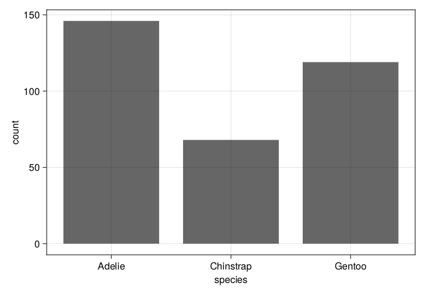
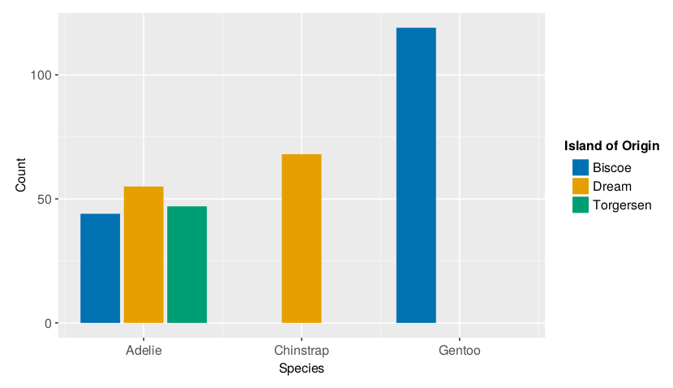
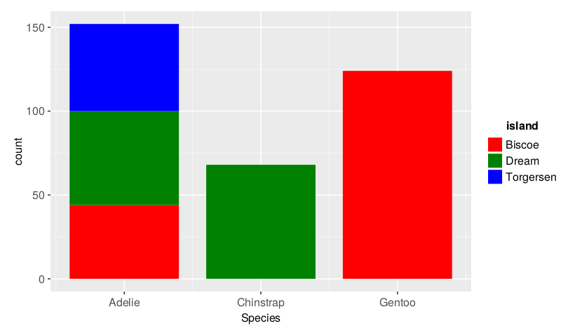
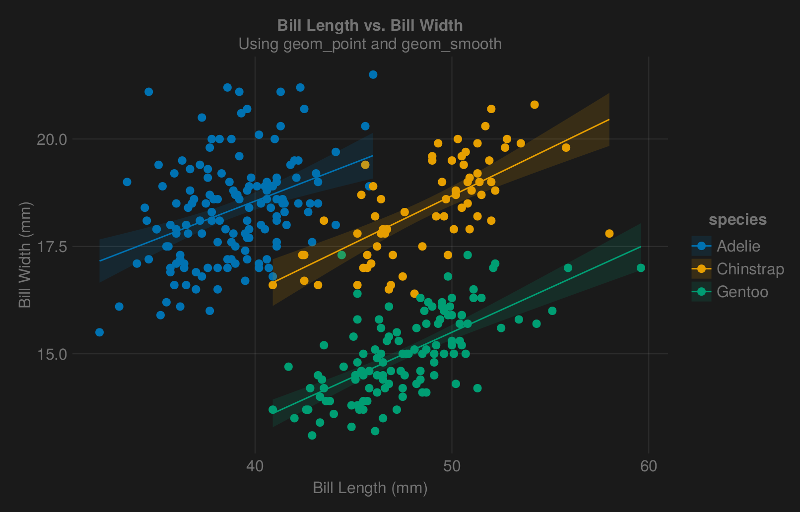
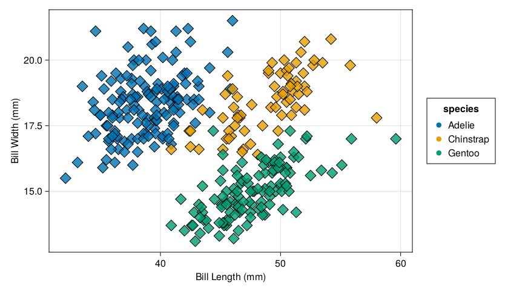
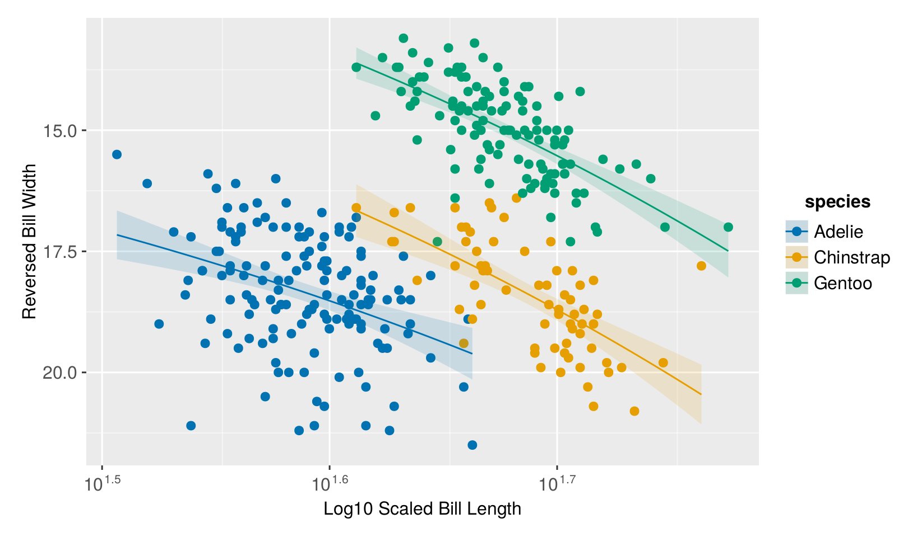
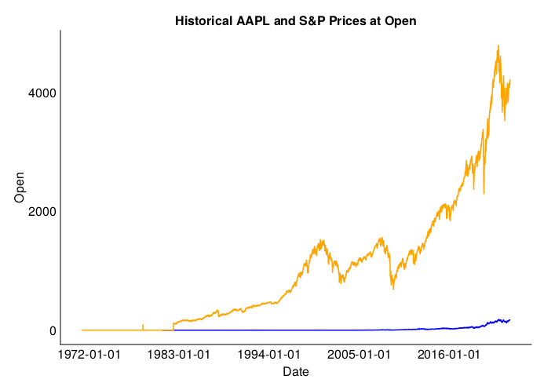
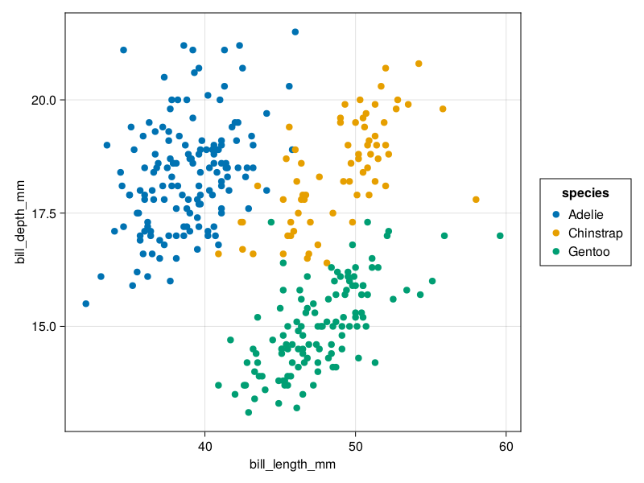
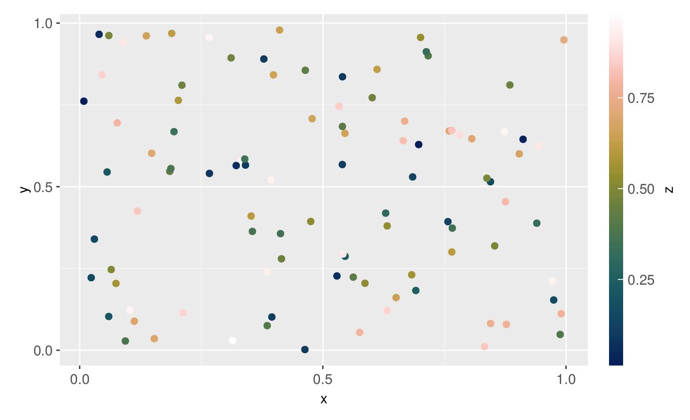

# TidierPlots.jl

[](https://github.com/TidierOrg/Tidier.jl/blob/main/LICENSE)


## What is TidierPlots.jl?
TidierPlots.jl is a 100% Julia implementation of the R package ggplot in Julia. Powered by the AlgebraOfGraphics.jl, Makie.jl, and Julia’s extensive meta-programming capabilities, TidierPlots.jl is an R user’s love
letter to data visualization in Julia.

`TidierPlots.jl` has three goals, which differentiate it from other plotting packages in Julia:

1.  **Stick as closely to tidyverse syntax and behaviour as possible:** Whereas other
    meta-packages introduce Julia-centric idioms for working with
    plots, this package’s goal is to reimplement ggplot
    in Julia. This means that `TidierPlots.jl` uses *tidy expressions* as opposed
    to idiomatic Julia expressions. An example of a tidy expression is
    `a = mean(b)`.

2.  **Stay as compatible as possible with AlgebraOfGraphics.jl** This package is meant
    to be a thin wrapper around AoG's syntax to help introduce R users to plotting in 
    Julia. `Geom` objects declared in TidierPlots.jl can be easily converted to AoG `Layer`
    objects using `Layer(Geom)`, and `GGPlot` objects can be converted to AoG `Layers` objects using `Layers(GGPlot)`.

3. **To Extend ggplot using julia-specific features where appropriate** as long as this does
    not confict with the first two goals. The package aims to behave exactly like ggplot
    unless told otherwise. Additional options and parameters that are not present in ggplot 
    may be added, but options that are present in R's ggplot should behave the way they do in R. 

## Installation

For the development version:

```julia
using Pkg
Pkg.add(url="https://github.com/TidierOrg/TidierPlots.jl")
```

## What functions does TidierPlots.jl support?

TidierPlots.jl currently supports the top-level function `ggplot()`, plus:

Geoms:

- `geom_point`
- `geom_smooth`
- `geom_errorbar`
- `geom_path`, `geom_line`, and `geom_step`
- `geom_bar`, `geom_col`, and `geom_histogram`
- `geom_boxplot` and `geom_violin`
- `geom_contour` and `geom_tile`
- `geom_density`
- `geom_text` and `geom_label`

Makie Themes:

- `theme_ggplot2()` (the default)
- `theme_dark()`
- `theme_black()`
- `theme_light()`
- `theme_minimal()`

Colour Scales:

- `scale_colo[u]r_manual()` - give a list of hex `values` enclosed in `c()` to define a scale
- `scale_colo[u]r_[discrete|continuous]()` - set `palette =` a [Makie palette]( https://docs.makie.org/stable/explanations/colors/index.html#colormaps). 

Facetting:

- `facet_wrap`: Specify `facets` variable.
- `facet_grid`: Specify `rows` and/or `cols`.

Additional Elements:

- `scale_[x|y]_[continuous|log[ |2|10]|logit|pseudolog10|sqrt|reverse]`
- `labs`
- `lims`

## Differences from ggplot2

The goal of this package is to allow you to write code that is as similar to ggplot2 code as possible. The only difference in basic usage is in the `aes()` function. TidierPlots.jl accepts multiple forms for aes specification, none of which is *exactly* the same as ggplot2.

- Option 1: `@aes` macro, aes as in ggplot, e.g. `@aes(x = x, y = y)`
- Option 2: `@es` macro, aes as in ggplot, e.g. `@es(x = x, y = y)`
- Option 3: `aes` function, julia-style columns, e.g. `aes(x = :x, y = :y)`
- Option 4: `aes` function, strings for columns, e.g. `aes(x = "x", y = "y")`

## Display Options

Use the function `TidierPlots_set(option::String, value::Bool)` to control display options. The following options are supported:

- "plot_show" (default true). Enables `ggplot`-like behaviour where plots are displayed when created.
- "plot_log" (default true). Prints a text summary of the properties of the ggplot

## Examples

Let's make some plots using the Palmer Penguins data from `PalmerPenguins.jl`:

```julia
using TidierPlots
using DataFrames
using PalmerPenguins

penguins = dropmissing(DataFrame(PalmerPenguins.load()))

ggplot(data = penguins) + 
    geom_bar(@aes(x = species)) +
    labs(x = "Species")
```



```julia
ggplot(data = penguins) +
    geom_bar(aes(x = :species, color = :island), position = "dodge") +
    labs(x = "Species", y = "Count", color = "Island of Origin") + 
    scale_colour_discrete(palette = "default")
```


```julia
ggplot(data = penguins) + 
    geom_bar(@es(x = species, color = island), position = "stack") +
    labs(x = "Species") + 
    scale_color_manual(values = c("#CB3C33", "#389826", "#9558B2"))
```



```julia
ggplot(penguins, aes(x = "bill_length_mm", y = "bill_depth_mm", color = "species")) + 
    geom_point() + 
    geom_smooth(method = "lm") +
    labs(x = "Bill Length (mm)", y = "Bill Width (mm)", 
        title = "Bill Length vs. Bill Width", 
        subtitle = "Using geom_point and geom_smooth") +
    theme_dark()
```



```julia
 ggplot(penguins, @aes(x = bill_length_mm, y = bill_depth_mm, color = species)) + 
    geom_point(shape = :diamond, 
               size = 20, 
               stroke = 1, 
               strokecolour = "black",
               alpha = 0.8) +
    labs(x = "Bill Length (mm)", y = "Bill Width (mm)") +
    lims(x = c(40, 60), y = c(15, 20)) +
    theme_minimal()

```


```julia
ggplot(penguins, @aes(x = bill_length_mm, y = bill_depth_mm, color = species)) + 
    geom_point() + 
    geom_smooth(method = "lm") +
    scale_x_log10(name = "Log10 Scaled Bill Length") + 
    scale_y_reverse(name = "Reversed Bill Width")
```


```julia
using MarketData: yahoo
AAPL = DataFrame(yahoo("AAPL"))
SPX = DataFrame(yahoo("^GSPC"))

ggplot(data = AAPL, @es(x = timestamp, y = Open)) + 
    geom_path(colour = "blue") + 
    geom_path(data = SPX, colour = "orange") + 
    labs(x = "Date", title = "Historical AAPL and S&P Prices at Open") +
    theme_minimal()
```



```julia
using AlgebraOfGraphics

data(penguins) * 
    Layer(geom_point(aes(x = :bill_length_mm, y = :bill_depth_mm, color = :species))) |> 
    draw
```



```julia
df = DataFrame(x=rand(100), y=rand(100), z=rand(100))
ggplot(df) + 
    geom_point(@aes(x = x, y = y, color = z)) + 
    scale_colour_continuous(palette = "batlowW100")
```

