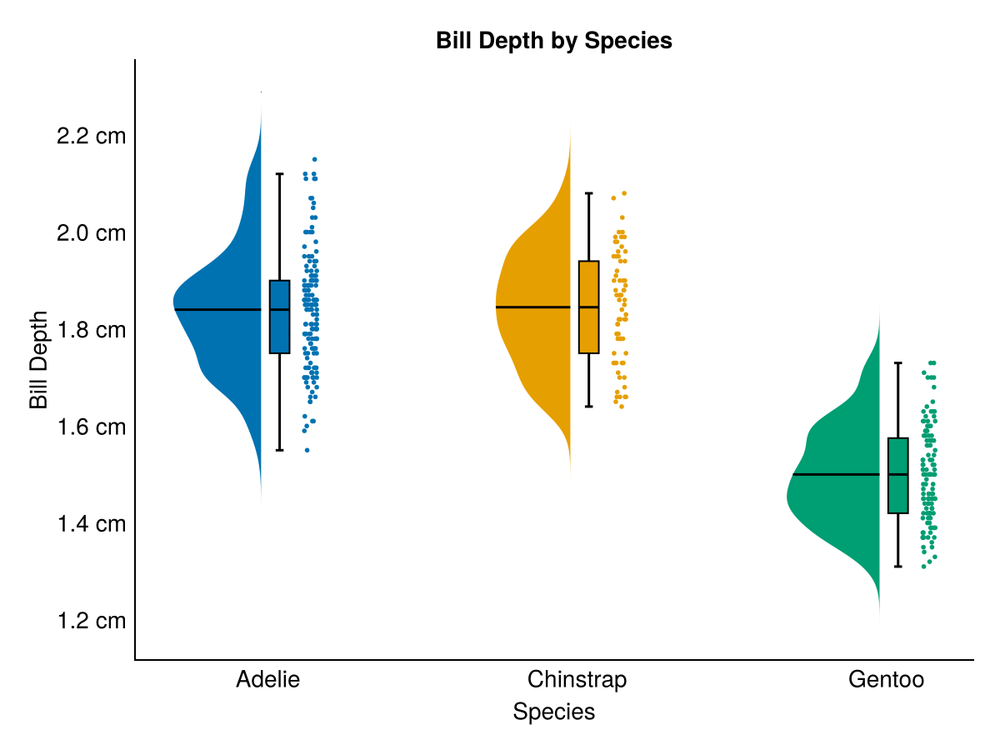

# TidierPlots.jl

[](https://github.com/TidierOrg/Tidier.jl/blob/main/LICENSE)
[](https://tidierorg.github.io/TidierPlots.jl/latest)
[](http://juliapkgstats.com/pkg/TidierPlots)
[](https://coveralls.io/github/TidierOrg/TidierPlots.jl?branch=main&kill=2)


## What is TidierPlots.jl?
TidierPlots.jl is a 100% Julia implementation of the R package [ggplot2](https://ggplot2.tidyverse.org/) powered by [Makie.jl](https://github.com/MakieOrg/Makie.jl).

`TidierPlots.jl` has three goals, which differentiate it from other plotting packages in Julia:

1.  **Stick as closely to tidyverse syntax and behaviour as possible:** Whereas other
    meta-packages introduce Julia-centric idioms for working with
    plots, this package’s goal is to reimplement ggplot
    in Julia. This currently just means that `TidierPlots.jl` gives the option for specifying `aes` with the macro `@es` to allow unquoted column references, but the use of macros may need to expand as more features are added.

2.  **Stay as compatible as possible with Makie.jl** This package is meant
    to be a thin wrapper around Makie's SpecApi syntax to help introduce R users to plotting in
    Julia.

3. **To Extend ggplot using julia-specific features where appropriate** as long as this does
    not confict with the first two goals. The package aims to behave exactly like ggplot
    unless told otherwise. Additional options and parameters that are not present in ggplot
    may be added, but options that are present in R's ggplot should behave the way they do in R.

## Installation

For the "stable" version, access the Pkg interface by pressing `]` at the `julia>` prompt, then type `add TidierPlots`.

For the development version:

```julia
using Pkg
Pkg.add(url="https://github.com/TidierOrg/TidierPlots.jl")
```

TidierPlots will also be installed automatically if you `add Tidier`.

## What functions does TidierPlots.jl support?

TidierPlots.jl currently supports the top-level function `ggplot()`, plus:

Geoms:

- `geom_point`
- `geom_errorbar`
- `geom_path`, `geom_line`, and `geom_step`
- `geom_bar`, `geom_col`, and `geom_histogram`
- `geom_boxplot` and `geom_violin`
- `geom_tile`
- `geom_density`
- `geom_text` and `geom_label`

Makie Themes:

- `theme_ggplot2()` (the default)
- `theme_dark()`
- `theme_black()`
- `theme_light()`
- `theme_minimal()`

Colour Scales:

- `scale_color_manual()` - set `values = c(c1, c2, c3, ...)`, accepts anything that can be parsed as a color by Colors.jl (named colors, hex values, etc.)
- `scale_color_[discrete|continuous|binned]()` - set `palette =` a [ColorSchemes.jl palette](https://juliagraphics.github.io/ColorSchemes.jl/stable/catalogue/) as a string or symbol. Also accepts ColorSchemes.jl color scheme objects.

Additional Elements:

- `scale_[x|y]_[continuous|log[ |2|10]|logit|pseudolog10|sqrt|reverse]`
- `labs`
- `lims`

## Display Options for Quarto, Jupyter, and Pluto.jl

Use the function `TidierPlots_set(option::String, value::Bool)` to control display options. The following options are supported:

- "plot_show" (default true). Enables `ggplot`-like behaviour where plots are displayed when created.
- "plot_log" (default true). Prints a text summary of the properties of the ggplot

You will likely want to disable both of these if you are working in a notebook environment. In [Pluto.jl](https://github.com/fonsp/Pluto.jl), you can get interactive plots (scroll, zoom, labels, etc.) using `WGLMakie` by including `WGLMakie.activate!()` as the first cell after your imports.

## Differences from ggplot2

The goal of this package is to allow you to write code that is as similar to ggplot2 code as possible. The only difference in basic usage is in the `aes()` function. TidierPlots.jl accepts two forms for aes specification, neither of which is *exactly* the same as ggplot2.

- Option 1: `aes` function, julia-style columns, e.g. `aes(x = :x, y = :y)` or `aes(:x, :y)`
- Option 2: `@aes` (or `@es`) macro, aes as in ggplot, e.g. `@aes(x = x, y = y)` or `@aes(x, y)`

If you use Option 1, functions can be applied to columns with the `=>` operator to form a `Pair{Symbol, Function}`, similar to how `DataFrames.jl` functions work.

```julia
my_fn(x) = x ./ 10

geom_point(aes(x = :x => my_fn))
```

Functions can take multiple columns as input. The following `geom_point` specification results in `x / y` (where `x` and `y` are the names of columns in a DataFrame) being plotted as the x axis of the graph:

```julia
my_new_fn(x, y) = x ./ y

geom_point(aes(x = [:x, :y] => my_new_fn))
```

With Option 2, functions will be interpreted using `TidierData.jl`:

```julia
# Macro aes equivalents to the above examples
geom_point(@aes(x = x / 10))
geom_point(@aes(x = x / y))
```

## Why would I use this instead of ggplot2?

**Right now, you probably wouldn't.** This package is still early in development, and is not ready for production use. However, there are a couple of advantages already and the list will hopefully get longer over time.

### Flexible access to Makie options

Access to all axis and plot options from `Makie` lets you use Makie's extensive capabilities for plot customization (example adapted from [beautiful.makie.org](https://beautiful.makie.org/examples/2d/scatters/bubble_plot_logxy)):

```julia
using Random, DataFrames
using TidierPlots
import Makie.IntervalsBetween, Makie.Attributes

Random.seed!(123)

xs = 10 .^ (range(-1, stop=1, length=100))

df = DataFrame(x = xs,
    y = xs .^ 2 .+ abs.(2 * randn(length(xs))),
    size = (xs .^ 2/3)[end:-1:1] .+ 6)

beautiful_makie_theme = Attributes(
    fonts=(;regular="CMU Serif"),
)

ggplot(df) +
    geom_point(aes(x = :x, y = :y, size = :size, color = :x), alpha = 0.8) +
    scale_x_log10() +
    scale_y_log10() +
    labs(x = "x", y = "y") +
    lims(y = c(.1, 100)) +
    scale_color_continuous(palette = "Hiroshige", name = "") +
    theme(
        xminorticksvisible=true,
        xminorgridvisible=true,
        yminorticksvisible=true,
        yminorgridvisible=true,
        xminorticks=IntervalsBetween(9),
        yminorticks=IntervalsBetween(9),
        backgroundcolor = :transparent,
        xgridstyle=:dash,
        ygridstyle=:dash
    ) + beautiful_makie_theme
```


### Built-in Support for Plot Layouts

Combine plots with a `{patchwork}`-inspired syntax to create complex layouts (adapted from [beautiful.makie.org](https://beautiful.makie.org/examples/2d/histogram/hists_on_the_sides)):

```julia
Random.seed!(123)
n = 200
df = DataFrame(x = randn(n) / 2, y = randn(n))

top = ggplot(df) +
    geom_histogram(aes(x = :x), fill = :orangered, strokewidth = 0.5) +
    lims(x = c(-4, 4)) +
    theme(xticklabelsvisible = false, xgridvisible = false) +
    beautiful_makie_theme

right = ggplot(df) +
    geom_histogram(aes(x = :y), fill = :dodgerblue,
        direction = :x, strokewidth = 0.5) +
    lims(y = c(-3, 3)) +
    theme(yticklabelsvisible = false, ygridvisible = false) +
    beautiful_makie_theme

middle = ggplot(df) + geom_point(aes(x = :x, y = :y), size = 10) +
    lims(x = c(-4, 4), y = c(-3, 3)) + labs(x = "x", y = "y") +
    beautiful_makie_theme

blank = ggplot() +
    theme(xticklabelsvisible = false, xgridvisible = false, yticklabelsvisible = false,
        ygridvisible = false, xtickcolor = :transparent, ytickcolor = :transparent,
        bottomspinevisible = false, topspinevisible = false, rightspinevisible = false,
        leftspinevisible = false) + beautiful_makie_theme

top + blank + middle + right +
    plot_layout(ncol = 2, nrow = 2, widths = c(3, 1), heights = c(1, 2))
```


### Easy Extensions with Makie

Add basic support for any Makie plot using `geom_template(name, required_aes, makie_plot)`. It will inherit support for most optional aesthetics and arguments automatically:

```julia
geom_raincloud = geom_template("geom_raincloud", ["x", "y"], :RainClouds)

ggplot(penguins) +
    geom_raincloud(@aes(x = species, y = bill_depth_mm/10, color = species), size = 4) +
    scale_y_continuous(labels = "{:.1f} cm") +
    labs(title = "Bill Depth by Species", x = "Species", y = "Bill Depth") +
    theme_minimal()
```


### Mix Makie Plots and TidierPlots

TidierPlots is creating Makie `SpecApi.GridLayout` objects under the hood, so you can easily combine TidierPlots output with Makie output for more flexibility:

```julia
using WGLMakie
import Makie.SpecApi as S
using TidierPlots
using DataFrames

r = LinRange(-1, 1, 100)
cube = [(x .^ 2 + y .^ 2 + z .^ 2) for x = r, y = r, z = r]
cube_contour = S.Contour(cube, alpha=0.5)
ax_cube = S.Axis3(; plots=[cube_contour], protrusions = (50, 20, 10, 0))

d = DataFrame(r = r, r2 = r .^ 2)
gg = ggplot(d) + geom_line(aes(x = :r, y = :r2))

plot(S.GridLayout([TidierPlots.as_GridLayout(gg) ax_cube]))
```


See the [documentation](https://tidierorg.github.io/TidierPlots.jl/latest) for more information and examples.

# What's New

See [NEWS.md](https://github.com/TidierOrg/TidierPlots.jl/blob/main/NEWS.md) for the latest updates.

# What's Missing

Lots! Please feel free to file an issue and/or submit a pull request to add additional ggplot-based features. If it is in ggplot, we want to add it.
